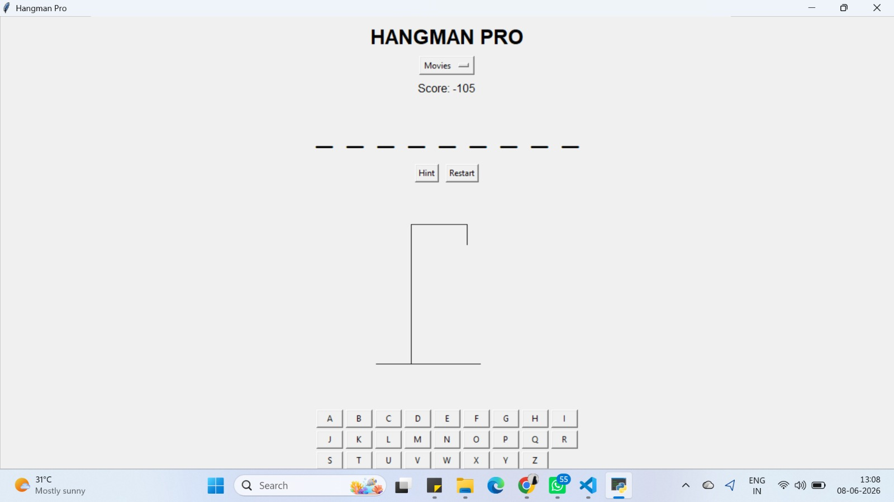
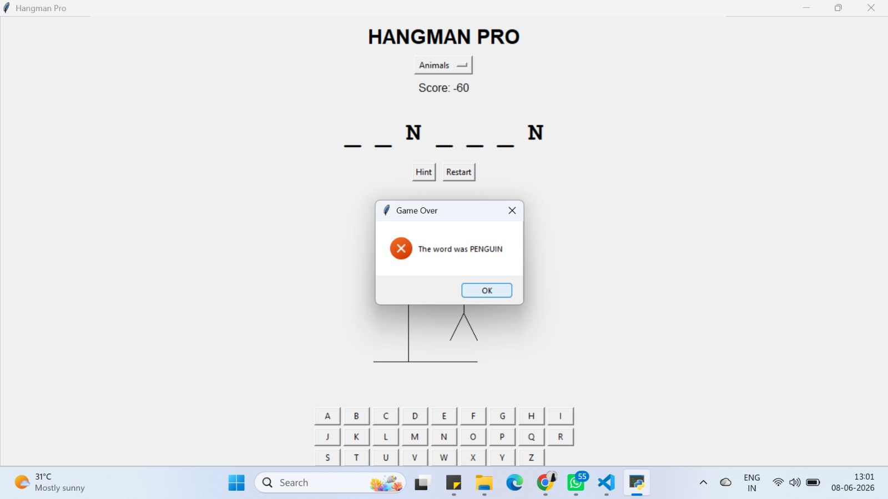

# Hangman Pro

## What Problem Does This Solve?

Traditional Hangman games are often limited to console-based interactions, offering minimal user engagement. This project provides a graphical desktop implementation of the classic game, enhancing the overall experience through interactive controls, visual feedback, category-based gameplay, and dynamic hangman rendering.

---

## Tech Stack

- Python
- Tkinter
- Canvas
- Random Module

---

## What Did I Specifically Build?

- A GUI-based Hangman game using Python and Tkinter.
- Category-based word selection system.
- Interactive A–Z on-screen keyboard.
- Dynamic hangman drawing using Canvas.
- Real-time score tracking system.
- Hint functionality for players.
- Restart game feature.
- Win/Loss detection with pop-up notifications.
- Event-driven gameplay and state management.

---

## Gameplay / Game Over Screen

---

## Results

- Successfully developed a fully functional desktop-based Hangman game.
- Implemented interactive gameplay through a graphical user interface.
- Integrated dynamic visual rendering using Tkinter Canvas.
- Applied event-driven programming concepts to manage game interactions.
- Created a scalable foundation for future enhancements such as difficulty levels, leaderboards, and persistent score tracking.

---

## Key Insights

- User experience significantly improves when transitioning from console-based applications to graphical interfaces.
- Event-driven programming requires careful management of game state and UI updates.
- Separating game logic from interface components improves maintainability and extensibility.
- Tkinter provides an effective way to build interactive desktop applications using only Python.

---
